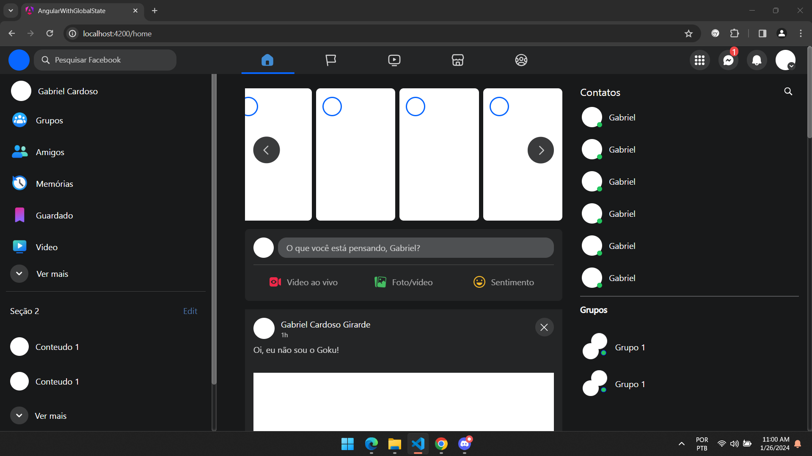
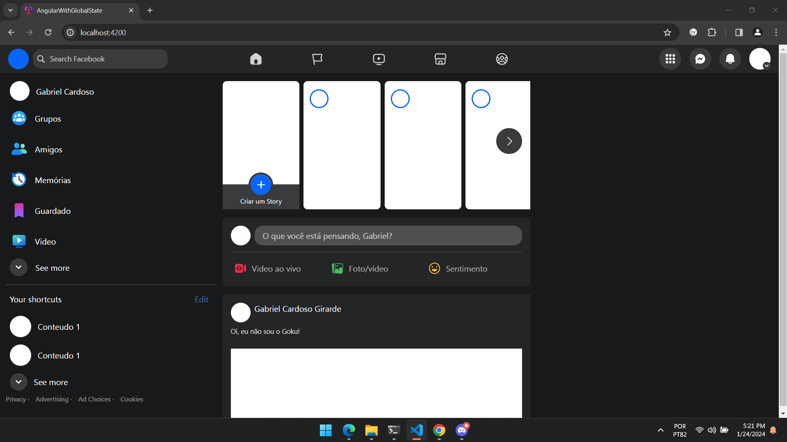
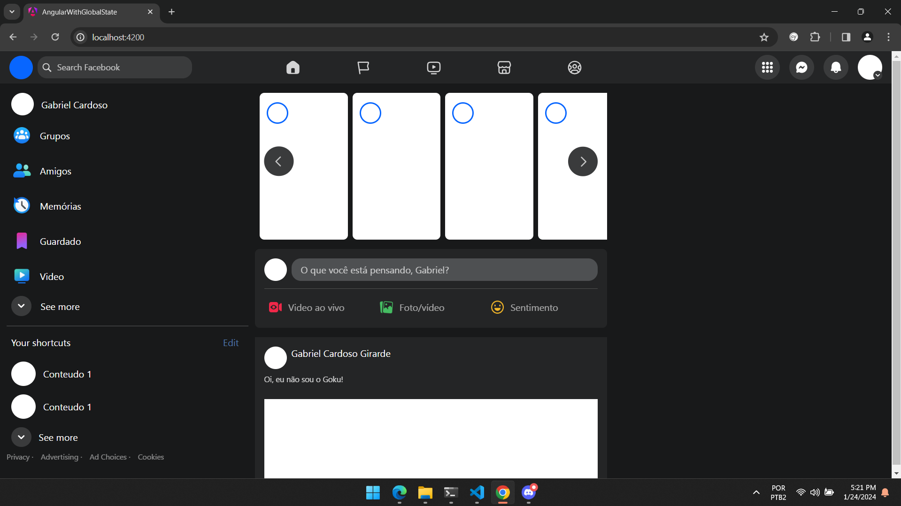

# Clone Facebook

O objetivo desse projeto é clonar o layout do Facebook, criar um backend utilizando C# com o framework ASP .NET e utilizar Ngrx pra ter controle do estado da aplicação. Nesse projeto eu não utilizo nenhum framework ou biblioteca de componentização ou estilização.

## Tecnologias

- Ngrx

- Angular

- Scss
